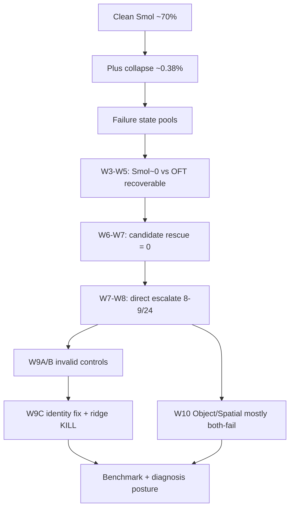

# RASE 全流程叙事：原计划 → 实验 → 转向 → 现状

**Date:** 2026-07-31  
**Purpose:** 让未参与日常实验的人，单靠本文即可理解 RASE 从立项到当前的完整科学流程。  
**Authority:** 逐次不可变实验细节仍以同目录 `YYYY-MM-DD_*.md` 与 `runs/` 原始产物为准；本文是综合叙事。

---

## 0. 三分钟读懂现在

RASE（Reliability-Aware Selection and Escalation）最初想做的是：

> 在冻结 VLA 策略失败时，采样候选动作 / fallback，并用学习型 selector 决定怎么救。

经过约两周的预注册实验，项目**没有**得到“学会了何时 escalate”的方法成功结论，而是得到一条更硬的诊断结论：

1. **恢复性是 policy-relative 的**：同一 failure snapshot 上，弱策略（SmolVLA）续完接近零，强策略（OpenVLA-OFT）有时能救回。
2. **救援机制不是 candidate 前缀**：candidate-specific rescue 在受测控制实验中为 0。
3. **可部署臂是 direct escalation**：直接切换到 OFT continuation，不必依赖 Smol 候选。
4. **轻量 ridge selector 未过预注册门**：held-out 上不优于 action-matched random，方法分支按规则终止，不上 MLP/RL。
5. **suite 异质性很大**：Goal/Long 上 recoverable 信号更清晰；W10 显示 Object/Spatial L1/L2 failure 上几乎双方都失败（Smol 0/16，OFT 1/16）。

**当前论文姿态：benchmark + diagnosis，不是 learned-selector 方法文。**

---

## 1. 项目是什么、环境是什么

### 1.1 科学对象

在视觉扰动（主要是 LIBERO-Plus 的 camera/robot 扰动）诱导的失败时刻：

- 是否还能恢复？
- 恢复依赖哪一个 continuation policy？
- 候选动作是否因果地造成恢复？
- 若存在可恢复子集，能否用成本敏感的三动作决策  
  `CONTINUE_SMOL / ESCALATE_OFT / ABSTAIN`  
  在 held-out 上打败 matched-random？

### 1.2 冻结模型与工程约束

| 角色 | 模型 | 说明 |
|---|---|---|
| Weak / continue | SmolVLA（冻结） | 默认 continuation |
| Strong / escalate | OpenVLA-OFT（按 suite 的冻结 ckpt） | 升级臂 |
| 环境 | LIBERO / LIBERO-Plus | clean baseline + Plus 扰动 |
| 关键能力 | ForkableEnv snapshot/restore | 同一 state 上配对比较多臂 |

纪律贯穿始终：

- 预注册比较与 kill rule；
- episode-group / task-group 防泄漏；
- 历史结果不覆写，只追加 progress；
- 失败 gate 后不得改 seed / 补采 / 放大模型来“救活”。

---

## 2. 原本计划（立项时的 idea）

最初设计接近“可靠执行层 + 学习选择器”：

```text
失败/不确定时刻
  → 采样 K 个候选动作 / fallback
  → 统计筛选可恢复候选
  → 训练 selector（后续可到 RL）
  → 在线选择 CONTINUE / FALLBACK_i / ABSTAIN
```

对应文档与工程意图：

- 设计报告与 top-conference execution plan（后收敛为 v4）；
- 五 fallback / DQN 等路线曾出现在早期 guide 中，但**从未成为最终被证据支持的执行主线**；
- 工程策略是 thin wrapper + frozen upstream，而不是重写整套 VLA。

**当时默认假设：**

1. 失败态上存在可恢复候选；
2. 候选内容对救援有贡献；
3. 学会选择候选/fallback 是主要 novelty；
4. 最终可走到 RL selector。

后续实验逐步否证或收缩了这些假设。

---

## 3. 阶段一：基线、崩塌与状态池（约 7/16–7/18）

### 3.1 做了什么

| 实验 | 结果 | 含义 |
|---|---:|---|
| SmolVLA clean LIBERO | **~70%** / 2000 ep | 基座策略在干净分布有效 |
| ForkableEnv W1 | 4/4 通过 | 可做同 state 多臂配对 |
| Plus collapse full | **~0.38%** | 视觉扰动形成强烈 failure frontier |
| NGC Step-1 scale200 | ~199 ep / 3666 states | 建立大规模失败态池 |

### 3.2 当时结论

- 问题设定成立：干净分布能做，扰动下几乎崩掉；
- 可以开始在失败 snapshot 上谈 recovery；
- 但池子极度 failure-biased，**还没有**可靠 clean control。

### 3.3 计划状态

仍按“候选采样 → 恢复筛选 → selector”推进。

---

## 4. 阶段二：候选与续完诊断（W2–W5，约 7/18–7/27）

### 4.1 关键结果

| 阶段 | 结果 | 对 idea 的冲击 |
|---|---|---|
| W2 候选多样性 | 通过 | 工程可行 |
| W3 Smol continuation | 多 cohort 近零（如 0/768） | Smol→Smol 几乎不恢复 |
| W3/W4 OFT 对照 | 同态上 OFT 有阳性 | 缺口更像 continuation policy |
| W4 ADEQUATE 32 | Smol **0/1536**；OFT portfolio **17/32** | 强不对称 |
| W5 温度扫描 | 0.3/0.7/1.0 合计 **0/576** | **关闭“多采样/调温度就能救”** |

### 4.2 第一次计划转化

从：

> 把候选采得更准、更多样，就能恢复。

转为：

> **Recoverability 是 policy-relative 的。**  
> 同一状态、甚至同一候选，换强 continuation 才可能恢复。

科学对象从“候选 reranker”变为“跨策略可恢复性”。

---

## 5. 阶段三：机制否证（W6–W7，约 7/27–7/29）

### 5.1 配对 pilot（W6）

- L1–L2 failure pool：40/40 failure episodes；
- 冻结 8-state paired matrix：Smol **0/8**，OFT **2/8**，McNemar `p=0.5`；
- 方向对，但功效不足。

### 5.2 因果归因（W7 discovery）

对 OFT-only 状态做 direct / zero-prefix / candidate-prefix 控制：

- **candidate-specific rescue = 0/2**（discovery）；
- 后续 held-out 归因中同类救援也为 0。

解释：

- 很多“候选命中”其实可被 **direct OFT** 或 **passive time** 解释；
- 不能把 OFT 成功写成“Smol 候选内容救了场”。

### 5.3 第二次计划转化（最关键）

从：

> 学习选择哪个 candidate / fallback。

转为：

> 检验 **何时 continue / 何时直接 escalate 到强策略 / 何时 abstain**。  
> Candidate any-of-K 只作诊断上界，不是部署动作，也不是训练标签。

动作空间冻结为：

```text
CONTINUE_SMOL
ESCALATE_OFT
ABSTAIN
```

---

## 6. 阶段四：Held-out 主结果（W7–W8，7/29）

### 6.1 W7 held-out24

与 W6 episode-group 不相交的 24-state failure cohort：

| 臂 | 结果 |
|---|---:|
| Smol | **0/24** |
| Prefix + OFT（any-of-8 portfolio） | **8/24** |
| McNemar（相对 Smol） | 显著（p≈0.0078） |

### 6.2 W8 direct OFT

| 臂 | 结果 |
|---|---:|
| Direct OFT | **9/24** |
| 与 prefix 配对 | both 7 / prefix-only 1 / direct-only 2 / neither 14；McNemar p=1.0 |

结论：

- **direct escalation 是真实可部署臂**；
- 它并不显著优于 prefix portfolio，但语义干净；
- 成功主要集中在 **Goal/Long**，Object/Spatial 很弱。

### 6.3 计划状态

主贡献明确为：

1. policy-relative recoverability benchmark；
2. 机制否证（candidate-specific rescue 不成立）；
3. 轻量 selector 作为**次级、有条件**方法贡献——必须先过 clean control 与 held-out matched-random。

---

## 7. 阶段五：Clean control 与 selector 门（W9–W9C，7/29–7/31）

### 7.1 为什么必须有 clean control

若只有 failure 数据，cost-aware selector 会塌成：

- always escalate，或
- 无法估计 clean regret。

因此预注册要求：先有有效 clean controls，再谈训练。

### 7.2 W9A / W9B：两次合法停机

| 版本 | 问题 | 处置 |
|---|---|---|
| W9A | episode/init 身份错误 | `diagnostic_invalid_for_control`，禁止训练 |
| W9B | Plus index 0–9 被误标为 clean-10；实际是 layout 变体 | 采满后 SR≈7.2%，coverage 失败；`diagnostic_wrong_task_identity` |

这两次停机保护了科学有效性：  
**低成功率不是“模型差”，而是任务身份错了。**

### 7.3 W9C：修好身份后再做正式方法门

修复：

- 用 official clean-10 的 exact BDDL/init；
- 修正 Long suite 错误语言；
- 新 pool / schedule 与旧 W9A/B 隔离。

结果：

| Gate | Outcome |
|---|---|
| Probe | **PASS**（suite SR 0.45 / 0.85 / 0.80 / 0.35，mean 0.6125） |
| Clean32 coverage | **PASS** |
| Episode/task readiness | **PASS** |
| Ridge vs action-matched random | **KILL**（两 held-out 上 Δutility=0） |

Direct-action 支持（W9C 合并数据）：

| Cohort | n | both | Smol-only | OFT-only | neither |
|---|---:|---:|---:|---:|---:|
| clean_control | 32 | 15 | 1 | 3 | 13 |
| failure_challenge | 24 | 0 | 0 | 9 | 15 |

Oracle labels：continue 16 / escalate 12 / abstain 28。

### 7.4 第三次计划转化

从：

> readiness 过了就可以上 MLP/RL。

转为：

> **最小合法模型（ridge）已失败；按 kill rule 终止方法分支。**  
> 论文主线冻结为 benchmark/diagnosis；selector 仅负结果 / appendix / future work。

特别限制：task-held-out test 只有 **8 个 clean states、0 failure、learned 0 escalation**。  
它足以触发 kill，但不能被解释成“跨任务 failure routing 已被充分否证”或“线性路由普遍不可能”。

---

## 8. 阶段六：Object/Spatial 覆盖（W10，7/31）

### 8.1 为什么做 W10

W7/W8 的 recoverable 正例偏 Goal/Long。若声称 suite-general recoverability，必须检查 Object/Spatial。

W10 预注册为：

- 新独立 Object/Spatial failure collection（80 ep）；
- 抽 16 failure states 做 direct Smol / direct OFT；
- 与冻结 W9C Object/Spatial clean 合并后做 split support；
- **禁止**训练 selector。

### 8.2 结果

| 项目 | 结果 |
|---|---:|
| Collection | **80 failure / 0 success** |
| Inventory | 8 cells 齐全，冻结 16 states |
| Direct Smol | **0/16** |
| Direct OFT | **1/16**（Spatial **0/8**） |
| Failure paired | both 0 / Smol-only 0 / OFT-only 1 / neither 15 |
| Escalate oracle | **仅 1 个状态** |
| Episode split | **`NOT_READY`**（val/test 无 escalate oracle） |

唯一 OFT-only：

- Object / robot / L2  
- `libero_object_000578` / `ep-0135277b-00000068`

### 8.3 第四次计划转化（当前）

从：

> 把 Object/Spatial 补齐后，benchmark 就“四面都有 escalation 信号”。

转为：

> **在该 L1/L2 camera/robot failure regime 下，Object/Spatial 几乎双方不可恢复。**  
> Recoverability 不仅是 policy-relative，也是 **suite-dependent**。  
> 正例主张必须收缩到有证据的 Goal/Long；Object/Spatial 记为覆盖负结果，而不是方法失败后的补丁训练场。

W10 **不重开** W9C 被 kill 的 selector 分支。

---

## 9. Idea 演化总表

| 阶段 | Idea | 被什么证据推动 |
|---|---|---|
| 立项 | 五 fallback + 学习 selector | 工程设想 |
| W2–W3 | 候选采样与统计筛选 | 候选工程可行 |
| W3–W5 | policy-relative recoverability | Smol 近零 vs OFT 有恢复；温度扫描全灭 |
| W6–W7 | 否证 candidate-specific rescue | direct/zero/prefix 控制 |
| W7–W8 | direct escalation 作为部署臂 | held-out 0/24 vs 8–9/24 |
| W9 | readiness 先于 learning | failure-only 不足以学 cost-aware 路由 |
| W9A/B | 数据身份 > 数字大小 | 错 task 导致假低 SR |
| W9C | ridge 最小方法门 | held-out 不优于 random → kill |
| W10 | suite 覆盖诊断 | Object/Spatial 几乎无 escalate 正例 |

---

## 10. 当前可以主张 / 不可以主张

### 10.1 可以主张

- 在受测 failure-conditioned、episode-disjoint cohort 上，存在 **policy-relative recoverability**（弱续完失败、强续完有时成功）。
- **Direct OFT escalation** 是可部署干预臂；不必依赖 Smol candidate proposal。
- **Candidate-specific rescue** 在受测控制中不成立。
- Clean-control 任务身份错误会导致假阴性；W9C 修复后 readiness 才有意义。
- 预注册 ridge selector **未**优于 matched-random；负结果应报告。
- Object/Spatial L1/L2 failure 上，当前设定下 escalate 正例极度稀缺（1/16）。

### 10.2 不可以主张

- “RASE 学会了何时 escalate / selector 泛化到 unseen tasks”。
- “any-of-K portfolio 是部署策略”。
- “candidate 内容因果地救援失败”。
- “failure-conditioned 恢复率 = 无条件任务成功率”。
- “Object/Spatial 也被 OFT 广泛救回”。
- “ridge 失败后应立刻上 MLP/RL”。
- “task-held-out 8-clean 结果证明线性路由普遍不可能”。

---

## 11. 证据地图（按贡献，不按时间）



主正例：

- W7/W8 Goal/Long-centric failure recoverability；
- 机制否证；
- clean-control 有效性修复；
- selector 负结果。

主负例 / 边界：

- Object/Spatial W10 覆盖失败于“有足够 escalate 正例”；
- task-held-out composition 过窄；
- single policy pair（Smol↔OFT）。

---

## 12. 现在的项目结构怎么读

| 路径 | 用途 |
|---|---|
| `progress/YYYY-MM-DD_*.md` | 逐次实验不可变记录 |
| `progress/2026-07-31_idea_evolution_and_next_questions.md` | claim / 否证 / 下一步问题 |
| `progress/2026-07-31_paper_claim_freeze.md` | 投稿允许/禁止主张 |
| `progress/2026-07-31_w10_object_spatial_benchmark.md` | 最新 Object/Spatial 覆盖结果 |
| `plan/RASE_top_conference_execution_v4.md` | canonical 执行原则 + kill criteria |
| `plan/README.md` | 当前 gate 状态索引 |
| `docs/runbooks/` | 可复现操作手册 |
| `runs/`、`pool/`、`ckpts/` | 本地产物（通常不入库） |
| `rase/`、`scripts/`、`configs/` | 代码、入口、冻结配置 |

---

## 13. 后续怎么走（截至 2026-07-31 的决策框架）

### 13.1 明确不再做

- 在当前数据上继续训 MLP / DQN / RL selector；
- 为让 W9C/W10 split “变绿”而改 seed、补采、放宽 requirement；
- 把 Goal/Long 的 recoverable 比例直接写成全 suite / 全 VLA 通论。

### 13.2 现在该做的选择

**选项 A — Claim contraction（更贴现有证据）**

- 主文强调：policy-relative recoverability + mechanism diagnosis；
- 正例以 Goal/Long 为主；
- Object/Spatial W10 作为 suite 边界负结果；
- selector 作负结果附录。

**选项 B — 新预注册覆盖扩展（若仍想救 Object/Spatial 正例）**

- 换 t0、扰动族、或第二 policy pair；
- 重新冻结 schedule 与 kill rule；
- 不是重跑 W10 seed `20260731`。

**选项 C — 外部效度增强（冲顶会时性价比高）**

- 增加第三个冻结 VLA 的 direct-only 复现；
- 仍不自动复活 selector。

### 13.3 一句话建议

先按 **选项 A** 把证据叙事写硬；若冲 CVPR 且时间允许，再加 **选项 C**；只有在有新机制假说时才开 **选项 B**。  
不要因为“还没训大模型”就回头做已被 kill 的方法线。

---

## 14. 关键数字速查

| 项目 | 数字 |
|---|---|
| Clean Smol baseline | ~70% |
| Plus collapse | ~0.38% |
| W4 Smol vs OFT portfolio | 0/1536 vs 17/32 states |
| W5 temperature | 0/576 |
| W7 Smol vs prefix+OFT | 0/24 vs 8/24 |
| W8 direct OFT | 9/24 |
| Candidate-specific rescue | 0（受测控制） |
| W9B 错身份 clean SR | ~7.2%（无效） |
| W9C probe mean SR | 0.6125 |
| W9C ridge held-out Δutility | 0 / 0 → kill |
| W10 collect | 80/80 failure |
| W10 direct Smol / OFT | 0/16 / 1/16 |
| W10 split | NOT_READY |

---

## 15. 延伸阅读顺序

若只读少量文件，建议按这个顺序：

1. 本文（总流程）
2. `2026-07-31_idea_evolution_and_next_questions.md`（主张边界）
3. `2026-07-31_paper_claim_freeze.md`（投稿冻结）
4. `2026-07-29_w8_direct_escalation_results.md`（主正例）
5. `2026-07-31_w9c_selector_gate_result.md`（方法门负结果）
6. `2026-07-31_w10_object_spatial_benchmark.md`（suite 覆盖负结果）
7. `2026-07-29_rase_status_narrative.md`（7/29 历史快照，注意顶部 superseded note）

---

## 16. 最终收束

RASE 不是“还没开始训练所以不知道行不行”。

更准确的说法是：

> 我们按预注册路径，把一个直觉上很强的 **learned fallback/selector** idea，推进到了可证伪的实验形态；  
> 证据表明：**跨策略可恢复性与 direct escalation 是真实现象，candidate 机制与线性 selector 在当前设定下不成立；**  
> Object/Spatial 覆盖进一步表明，这个现象还有强烈的 suite 边界。  

因此项目现在的价值，首先是把问题测清楚、把错误机制否证清楚；  
任何新的“能工作的方法”，都必须是一条**新的预注册**，而不是对已 kill 分支的加宽模型重跑。
